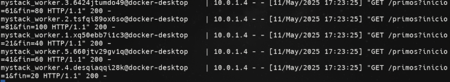

# Stack Prime

**Alumno:** Álvaro Pereda Sánchez

**Calificación:** /10

He elegido el apartado D del [enunciado](./Practica5.pdf). 

## Arquitectura del Programa

Todo está explicado en la [memoria del proyecto](./Memoria.pdf).

El programa se ejecuta en la dirección [http://localhost:8000](http://localhost:8000/)

---

## Comandos utilizados

A continuación se describen los comandos esenciales para configurar, desplegar, visualizar y limpiar el entorno de clúster. 
Todos estos comandos se deben realizar desde la carpeta raiz del proyecto.

### Iniciar docker swarm

```
docker swarm init
```

Este comando inicia el software de orquestación de Docker. 

### Construcción del entorno

```
docker compose build
```

Este comando construye los contenedores definidos en el archivo `docker-compose.yaml`.

### Despliegue del clúster

```
docker stack deploy -c docker-compose.yaml mystack
```

Este comando despliega el stack definido con Docker Compose bajo el nombre `mystack`.

Si se quiere modificar la cantidad de réplicas worker se debe cambiar el valor definido en el archivo [.env](./.env)

### Visualización de logs

```
docker service logs -f mystack_worker
```

Permite observar cómo se están ejecutando los distintos contenedores `worker`, con los parámetros asignados a cada uno para su cálculo.



### Eliminación del stack

```
docker stack rm mystack
```

Este comando elimina el stack desplegado.

### Eliminación de imágenes

Una vez que el stack ha sido eliminado, se pueden borrar las imágenes con el siguiente comando:

```
docker rmi worker; docker rmi coordinator
```

Esto asegura que las imágenes de los servicios `worker` y `coordinator` sean eliminadas completamente.

---

## Diagrama de flujo

```mermaid
flowchart TD
    A[Usuario accede a página web] --> B[Contenedor Coordinador recibe petición]
    B --> C[Usuario introduce un número] 
    C --> D[Coordinador divide entre N contenedores trabajadores y envia el rango que debe calcular cada uno]
    D --> E[Trabajadores calculan los números primos de su rango]
    E --> F[Trabajadores devuelven resultados al coordinador]
    F --> G[Coordinador agrupa resultados]
    G --> H[Coordinador muestra resultados en la web]
    H --> C

